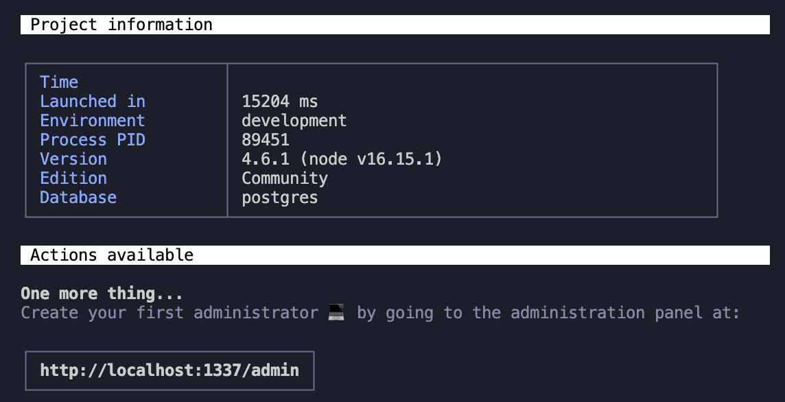
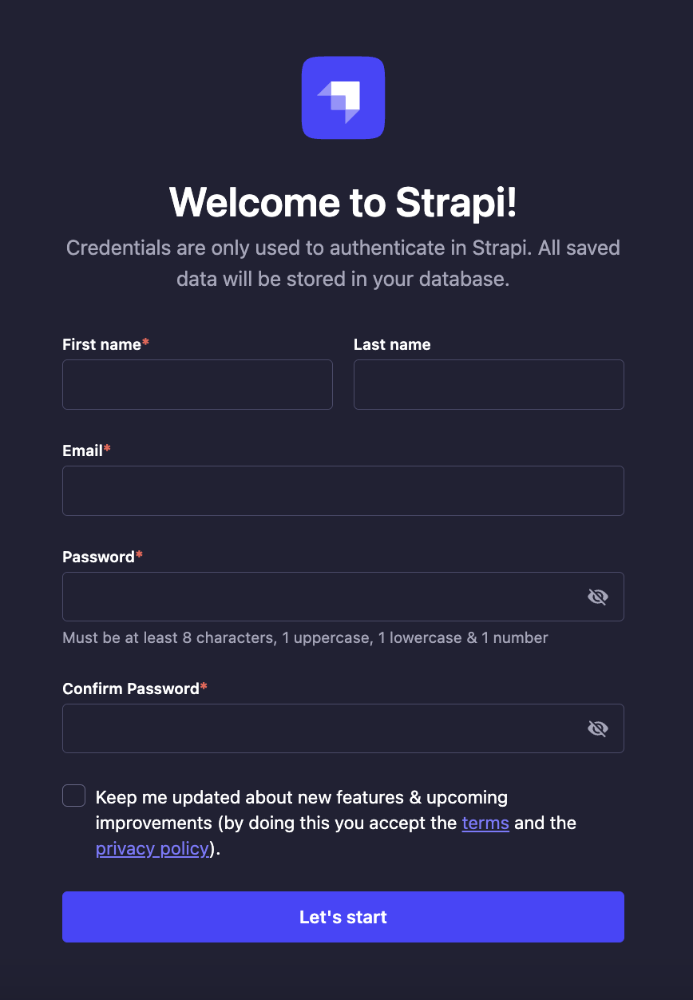

# Serverless Strapi

Template to kickstart hosting Strapi on AWS Lambda, connect to AWS S3 and AWS RDS.

# Table of content

- [Serverless Strapi](#serverless-strapi)
- [Table of content](#table-of-content)
- [Why?](#why)
- [Get Started](#get-started)
  - [Prerequisites](#prerequisites)
  - [Actually Get Started](#actually-get-started)
    - [Setup Infrastructure With Terraform](#setup-infrastructure-with-terraform)
      - [Initialize](#initialize)
      - [Configuration](#configuration)
      - [Build](#build)
      - [Obtain Bucket User Access Key](#obtain-bucket-user-access-key)
      - [Obtain Strapi Server Url using Serverless Framework](#obtain-strapi-server-url-using-serverless-framework)
    - [Test Strapi App](#test-strapi-app)
      - [Configuration](#configuration-1)
      - [Test Run](#test-run)
    - [Deploy Strapi App With Serverless Framework](#deploy-strapi-app-with-serverless-framework)
- [Caveats](#caveats)
  - [Strapi Will Not Have Open Internet Access](#strapi-will-not-have-open-internet-access)
  - [Maximum File Size When Upload](#maximum-file-size-when-upload)

# Why?

You might be thinking, why choose serverless Strapi when you can run Strapi on a dedicated server? The answer is: **COST!**. I tried running Strapi in a AWS ECS, connecting to AWS S3 and AWS RDS. The problem is that Strapi will be constantly running, burning through AWS RDS's free tier connection time, racking up the total bill. The total cost for the non-serverless architecture is roughly $20/month: $10/month for AWS ECS, and $10/month for AWS RDS. That number is way too high for a college student doing side projects for fun! There are several way to cut costs for the non-serverless architecture:

- Self host your own database: by running your database in a self hosted AWS EC2 instance, you can cut your database cost down to $4/month (the lowest plan for AWS EC2 that I know of). The downside is that the database is missing all the essential features like instant rollback, backup, multiple availability zones read duplicates, and not to mention you have to occasionally fix networking, VPC issues. Using AWS RDS can help you forget about database management (hence the cost), and personally, I prefer this trade-off for my use case.
- Self host your Strapi: obviously you can run Strapi on your own server. Strapi recommend at least 2GB of memory to build and run Strapi. If you are a college student running side project (like me), chances are you don't have a hobby server lying around in your dorm, so the next option would be to rent a server somewhere. Most of the providers I looked around offers 2GB memory servers at around $10-12/month (Digital Ocean droplets, Linode), which is essentially the same cost of AWS ECS, without the reliability of AWS (I'll leave that statement up for debate).

The solution? Running Strapi on serverless architectures, specifically AWS Lambda. This significantly lower the cost of running Strapi because the server runs on demand. In addition, it also lowers AWS RDS cost because there is not active connections to it while Strapi is not running, making AWS RDS essentially free with the AWS free tier. Therefore, the upside of running serverless architecture for my use case is **COST!**, something that I care very much about. Of course, there are downsides of running serverless architecture, most importantly (drum roll...) the cold start time.

Basically, to have your Strapi runs on demand, AWS services would fetch a Strapi container image from AWS ECR, spin up the container image, load the package code into memory, finally begin execution of Strapi. This whole process takes rougly 2-5 seconds without any optimization techinique, which is unacceptably slow for a CMS. The reason it is valid for my use case because I host a static blog website using NextJS, which builds the packages on the server and distribute the rendered static files to all of Vercel's CDN to deliver blogs to users. This mean that user does not make a direct API call to the Strapi, rather the NextJS server that build static files does. This means that only when the server build static files does the system experience the consequence of cold start Strapi. This is not a dire consequence, considering the fact that end users can still experience the quick response time from having static files delivered to their web browsers from a CDN.

Of course, if your use case requires end users to communicate directly with Strapi, there are techniques to reduce, or even eleviate cold start time (i.e eCommerce platforms). However, I would recommend running Strapi on AWS ECS if you absolutely prioritize response time.

# Get Started

Enough explaining, you can try this Serverless Strapi by following these instructions. After this tutorial, you will have a Strapi running, attached to all relevant AWS services in your AWS account.

## Prerequisites

Before getting start with this tutorial, here are a few prerequisites. Feel free to skip this part if you have already satisfied all of these:

- **Git**: You can install Git by following Github's [official documentation](https://github.com/git-guides/install-git)
- **AWS account**: head to [https://aws.amazon.com](https://aws.amazon.com) to create your AWS account and login to the dashboard
- **AWS security keys**: this can be obtain using this AWS's [official documentation](https://docs.aws.amazon.com/powershell/latest/userguide/pstools-appendix-sign-up.html)
- **AWS CLI**: this can be obtain using this AWS's [official documentation](https://docs.aws.amazon.com/cli/latest/userguide/getting-started-install.html)
- Configure AWS CLI to use the AWS security keys by following this AWS's [official documentation](https://docs.aws.amazon.com/cli/latest/userguide/cli-configure-files.html). Basically we are editing the `~/.aws/credentials` file with the following content:

```bash
[default]
aws_access_key_id=tobemodified
aws_secret_access_key=tobemodified
```

- **NVM (Node Version Manager)**: Because Strapi is a NodeJS/Javascript based software, we need to install NodeJS for it to run. The best way to install NodeJS on your machine is to install it through Node Version Manager. Following this NVM's [official documentation](https://github.com/nvm-sh/nvm#install--update-script) to install NVM on your machine
- Node16 (NodeJS version 16): Strapi uses NodeJS version >=14.19.1 and <=18.x.x. Personally I found 16 works but feel free to install any other version within the required NodeJS version range for Strapi:

```bash
# Run this command to install NodeJS version 16
nvm install 16

# After installation complete, run this command to use it whenever we want to run a NodeJS program
# The command should confirm that you have installed node and npm (node package manager)
nvm use 16
```

- **Yarn** (a better node package manager than npm): This project uses yarn to install and manages all packages required to run Strapi

```bash
# Install yarn using the following command
npm install --location=global yarn

# Confirm your installation with this command. It should print your version of yarn
yarn -v
```

- **Terraform**: This project uses Terraform to setup almost all AWS infrastructures (i.e S3, RDS, IAM, VPC). Of course, you can manually set all of those up on AWS dashboard, but I recommend using Terraform because having infrastructure as code helps maintain the integrity of the project's infrastructure where every component of the architecture is explicited configured as hard written code. You can following HashiCorp's [official documentation](https://developer.hashicorp.com/terraform/tutorials/aws-get-started/install-cli) to install Terraform on your machine.

```bash
# Use this command to confirm your terraform installation. It should print your version of terraform
terraform -v
```

- **Serverless Framework**: Remember when I said this project uses Terraform to setup almost all AWS infrastructures (don't worry I'll wait for you to scroll up)? The rest of the infrastructure is going to be setup using Serverless Framework (i.e Lambda, API Gateway, ECR, CloudFormation). Notice that both Terraform and Serverless Framework can be use to setup the entire architecture of this project, but I choose both because they both have their pros and cons and why not merge the best of both worlds together with a little extra overhead of installing both: I use Terraform to setup non-application architectures like S3, RDS, IAM, VPC, and Serverless Framework to setup application architectures like Lambda.

```bash
# Use this command to install serverless framework
npm install --location=global serverless

# Confirm your installation
serverless -v
```

- **Docker**: Serverless Framework uses Docker to build Strapi image locally and upload it to AWS ECR, then instruct Lambda to fetch from that image everytime it cold starts. Following Docker's [official documentation](https://docs.docker.com/get-docker/) to install Docker on your machine.

## Actually Get Started

Start by cloning this repository:

```bash
git clone https://github.com/WilsonLe/serverless-strapi
```

### Setup Infrastructure With Terraform

#### Initialize

Let's first begin with setting up the infrastructure for Strapi.

```bash
yarn tf init
```

#### Configuration

Open up the `example.secrets.auto.tfvars` file in the `terraform` directory and update the configuration based on the following table. I recommend using a random password generator without special character/symbols to generate passwords, secrets, keys, tokens, and salt (personally I use [lastpast password generator](https://www.lastpass.com/features/password-generator#generatorTool)).

| Variables         | Example   | Description                                                                                           |
| ----------------- | --------- | ----------------------------------------------------------------------------------------------------- |
| region            | us-east-2 | AWS region to deploy all infrastructure for serverless Strapi                                         |
| DATABASE_PORT     | 5432      | Database port for Terraform to setup. If you want to create PostgreSQL, the default is "5432"         |
| DATABASE_NAME     | postgres  | Database name for Terraform to setup. If you want to create PostgreSQL, the default is "postgres"     |
| DATABASE_USERNAME | postgres  | Database username for Terraform to setup. If you want to create PostgreSQL, the default is "postgres" |
| DATABASE_PASSWORD |           | Arbitrary string with no special character or symbols. Make it super secret!                          |

After you have modified all the value in the file, rename the file from `example.secrets.auto.tfvars` to `secrets.auto.tfvars` (basically remove the leading `example.`). Terraform will automatically parse this secret file when creating infrastructure.

#### Build

Use the following command to double check if terraform is creating the accurate infrastructure. Note that our terminal current working directory is still in `terraform` directory. The output should be about terraform is planning to add some infrastructures, nothing to change, and nothing to destroy.

```bash
yarn tf plan
```

Use the following command to build out our serverless infrastructure.

```bash
yarn tf apply
```

#### Obtain Bucket User Access Key

Terraform script will create a user to interact with AWS S3 storage bucket. We will need to obtain access keys to the users to be able to interact with AWS S3 storage bucket.

```bash
# Run this command to obtain bucket user's username
yarn tf output serverless-strapi-bucket-user

# Run this command to create an obtain an access key of the bucket user
aws iam create-access-key --user-name <username-output>
```

Copy that the value of "AccessKeyId" and "SecretAccessKey" to somewhere safe. You won't be able to obtain the "SecretAccessKey" again. If you lost your "SecretAccessKey", I you should create another access key. Use the commands below to help you:

```bash
# List all access keys of a user
aws iam list-access-keys --user-name <username-output>

# Delete access key of a user
aws iam delete-access-key --user-name <username-output> --access-key-id <access-key-id>

# Recreate another access keys, this time don't lose the SecretAccessKey
aws iam create-access-key --user-name <username-output>
```

#### Obtain Strapi Server Url using Serverless Framework

### Test Strapi App

After all your infrastructure is setup, we begin running our Strapi application locally while connecting to all new cloud infrastructures.

#### Configuration

Open `.env.example` in the project's root directory and update the environment variable accordingly:

| ENV                            | Example                      | Description                                                                                                                       |
| ------------------------------ | ---------------------------- | --------------------------------------------------------------------------------------------------------------------------------- |
| NODE_ENV                       | development                  | Environment to deploy Strapi, possible values are "development" and "production"                                                  |
| VPC_SECURITY_GROUP_IDS         | sg-123,sg-321                | Comma separated value of security group ids. This can be obtained by running `yarn tf output serverless-strapi-security-group-id` |
| VPC_SUBNET_IDS                 | subnet-123,subnet-321        | Comma separated value of subnet ids. This can be obtained by running `yarn tf output serverless-strapi-subnet-group-*`            |
| API_GATEWAY_BINARY_MEDIA_TYPES | image/\*,multipart/form-data | Comma separated value of binary types allowed to pass through AWS API Gateway                                                     |
| LAMBDA_REGION                  | us-east-2                    | AWS region to deploy AWS Lambda for serverless Strapi                                                                             |
| SERVER_URL                     | your-custom-domain.com       | Optional, use this if you want to have custom domain name for your Strapi server                                                  |
| HOST                           | 0.0.0.0                      | Strapi server host name                                                                                                           |
| PORT                           | 1337                         | Strapi server port number                                                                                                         |
| APP_KEYS                       |                              | Comma separated value of arbitrary string with no special character/symbols                                                       |
| API_TOKEN_SALT                 |                              | Arbitrary string with no special character/symbols                                                                                |
| ADMIN_JWT_SECRET               |                              | Arbitrary string with no special character/symbols                                                                                |
| JWT_SECRET                     |                              | Arbitrary string with no special character/symbols                                                                                |
| DATABASE_HOST                  |                              | This can be obtained by running `yarn tf output serverless-strapi-database-address`                                               |
| DATABASE_PORT                  |                              | This should match whatever value you have when configuring infrastructure via terraform                                           |
| DATABASE_NAME                  |                              | This should match whatever value you have when configuring infrastructure via terraform                                           |
| DATABASE_USERNAME              |                              | This should match whatever value you have when configuring infrastructure via terraform                                           |
| DATABASE_PASSWORD              |                              | This should match whatever value you have when configuring infrastructure via terraform                                           |
| AWS_BUCKET_NAME                |                              | This can be obtained by running `yarn tf output serverless-strapi-bucket-name`                                                    |
| AWS_BUCKET_REGION              |                              | This can be obtained by running `yarn tf output serverless-strapi-bucket-region`                                                  |
| AWS_BUCKET_ACCESS_KEY_ID       |                              | Refer to the values from the step [Obtain Bucket User Access Key](#obtain-bucket-user-access-key)                                 |
| AWS_BUCKET_ACCESS_SECRET       |                              | Refer to the values from the step [Obtain Bucket User Access Key](#obtain-bucket-user-access-key)                                 |

After you have updated all the environment variables, rename the `.env.example` file to `.env` (basically removing the trailing `.example`).

#### Test Run

```bash
# Run this command to test run Strapi on your machine
yarn dev
```

Hopefully, you should get an output like this:


Following the link, we got this Strapi dialog:


### Deploy Strapi App With Serverless Framework

There isn't much to setup for Serverless Framework. You can check out the `serverless.yml` configuration files to learn more, but if you have setup `.env` files correctly, and you have sucessfully run Strapi locally on your machine using AWS infrastructure created with Terraform, then you are all set to deploy your Strapi application into AWS Lambda with Serverless Framework.

This command will use Docker to build a container image locally from all the files from this directory. I highly recommend deploying Strapi with production configurations by editing `.env` to have `NODE_ENV=production`, load the `.env` file into the current terminal session, build Strapi with production configuration, then deploy. The production method will build Strapi in a more optimize way, making the package size smaller, which helps significantly decrease Lambda cold start time.

**DO NOT DEPLOY STRAPI IN DEVELOPMENT CONFIGURATION**. If you deploy Strapi with development configuration, you will have the ability to update content types, which - if you do - will update database schema and code inside the deployed Docker container (but not update your source code configuring Strapi). This means between database and source Strapi, there will be inconsistency and Strapi will basically stop functioning.

```bash
# 1. Edit .env to have NODE_ENV=production

# 2. Load .env into current terminal
source .env

# 3. Build Strapi with production configuration
yarn build

# 4. Deploy Strapi
yarn svl deploy
```

The deployment process will take anywhere from 5-20 minutes for the first run. This is because under the hood, the deploy command is doing the following:

1. Create a repo in AWS ECR to store container images
2. Build a Strapi container image using Docker locally
3. Upload the Strapi container image to ECR
4. Setup Cloud Formation to deploy AWS Lambda with the specified configuration

# Caveats

There are some caveats with this form of deployment.

## Strapi Will Not Have Open Internet Access

This applies for all Lambda functions that lives in AWS VPC. Lambda functions will have access to other AWS services, but will not have access to open internet access (atleast, by default). This [blog post](https://nodogmablog.bryanhogan.net/2022/06/accessing-the-internet-from-vpc-connected-lambda-functions-using-a-nat-gateway/) gives a pretty good explanation why and how to allow your Lambda function have access to the internet. The problem with the solution in the blog post is that it significantly increases the **COST** to roughly $25/month for all the network component it introduces to our serverless architecture.

## Maximum File Size When Upload

The core upload plugin of Strapi with the [upload-aws-s3](https://market.strapi.io/providers/@strapi-provider-upload-aws-s3) provider will turn Strapi into a file proxy to AWS S3. Since Strapi is running inside Lambda and is invoked through an API Gateway, we are limitted by the API Gateway file size limitation, which is 10Mb at the time of writing this. A solution that I'm investigating is to shove the responsibility of uploading files to S3 to the client admin panel. When uploading a file, the admin panel make a request to server, asking for a presigned url. Using that presigned URL, we proceed to upload the file, and make a request to Strapi notifying of the new file upload for Strapi to update database. One issue that I have not been able to solve is that Strapi introduces a series of file processing middlewares, and by not directly passing user uploaded file through Strapi, the file will not be consistent with how Strpai stores file metadata. This caveat does have a solution but requires further investigation and possibly an issue/pull request on Strapi's core upload plugin to enable file upload through external services such that file metadata is still consistent in database.
